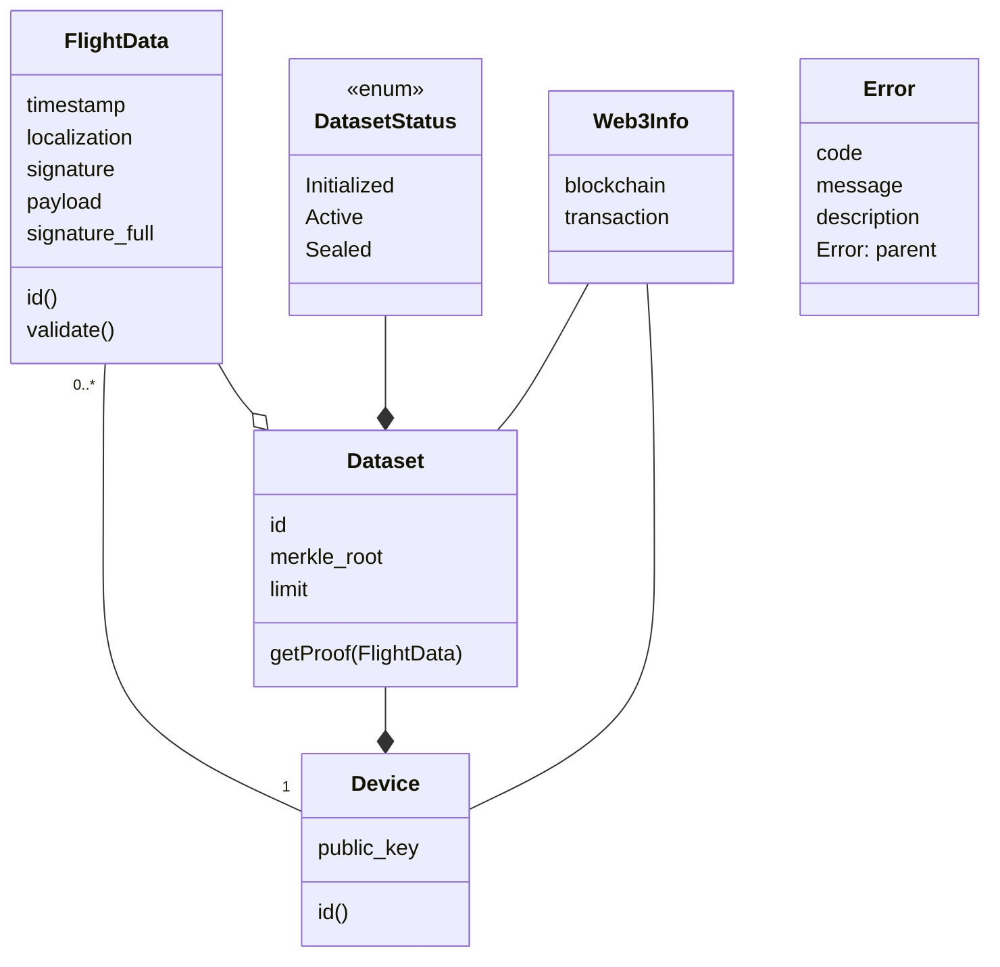

# Bitacora
Bitacora is the Blockchain API for the CertiFlight portal in the CertiFlight project. The "cuaderno de bitácora" is the old sailors logbook.
## Documentation
### Data Model
The API assumes the following data model. Graphs are rendered with mermaid.js

- **FlightData** represents the data produced and sent by the device. The `payload` and `signature_full` fields are absent in the live data submission. They can complement a certain `FligthData` when full data is downloaded from the device.
- **Dataset** is a list of `FlightData` consolidated under the same [Merkle tree](https://en.wikipedia.org/wiki/Merkle_tree). It may be automatically generated by the Blockchain API server according to a default configuration.
- **DatasetStatus** is an enumeration providing information on the status of the `Dataset`:
    - *Initialized*: A new `Dataset` with no `FlightData` inside;
    - *Active*: `Dataset` has at least one `FlightData` assigned and can continue accepting more;
    - *Sealed*: The Merkle tree of the containing `FlightData` was computed so no new instances can be accepted
- **Device** is the class representing a physical CertiFlight device. It is uniquely identified by its public key. A more handy Id can be used by hashing the public key.
- **Web3Info** wraps the information regarding a submission to the configured blockchain.
- **Error** provides a conventional way for error propagation.

### Workflow
The main workflows of the system are:
1. Live data submission: (data collected during the flight)
    1. Submit a new FligthData object with no  `payload` and `signature_full` properties;
    2. For each device, the system accumulates `FlightData` in a `Dataset`;
    3. According to a predefined limit, once a `Dataset` is full, the system creates a Merkle tree with its data and submits its root to the blockchain smart contract
    4. The status of the `Dataset` Merkle tree can be queried with the relative endopoint.
2. Full data submission: (data collected after the flight)
    1. Submit a new `FlightData`, including the `payload` and `signature_full` properties; if data was already sent before as light data, already submitted fields can be omitted and the Id of the already existing `FlightData` can be used.
    2. For each device, the system accumulates `FlightData` in a `Dataset`;
    3. According to a predefined limit, once a `Dataset` is full, the system creates a Merkle tree with its data and submits its root to the blockchain smart contract
    4. The status of the `Dataset` Merkle tree can be queried with the relative endopoint.

We could also design an asynchronous mechanism (e.g. a Pub/Sub) for obtaining the `Web3Info` information, so that it is not necessary to poll it periodically untill ready

### API definition
The API is defined as a REST API using JSON over HTTP. It generally passes data in the messages body while configurations and options are passed as query parameters.

The following list is a summary of the available resources and methods. A precise description with example requests and responses is available in the Postman collection.

- Device
    - GET: Fetch the requested Device information
    - POST: Create a new Device
- FlightData
    - GET: Fetch the requested FlightData information
    - POST: Create a new FlightData
    - PATCH: Updates an existing FlightData with full information (e.g. lightweight live data are updated with the ones downloaded after the flight)
- Dataset
    - GET: Fetch the requested Dataset information
    - POST: Creates a new Dataset