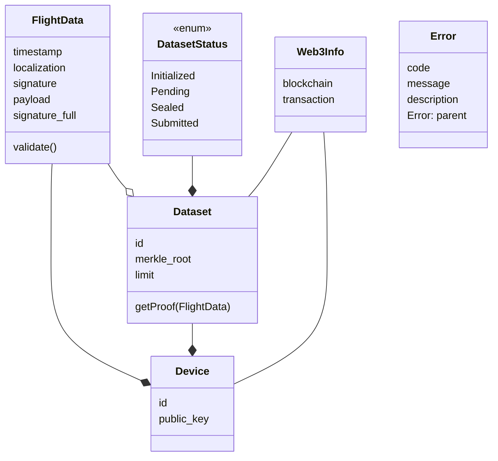

# Bitacora
Bitacora is the Blockchain API for the CertiFlight portal in the CertiFlight project. The "cuaderno de bitácora" is the old sailors logbook.
## Documentation
### Data Model
The API assumes the following data model. Graphs are rendered with mermaid.js

### API definition
The API is defined as a REST API using JSON over HTTP. It generally passes data in the messages body while configurations and options are passed as query parameters.

The following list is a summary of the avialble resources and methods. A precise description with example requests and responses is available in the Postman collection.